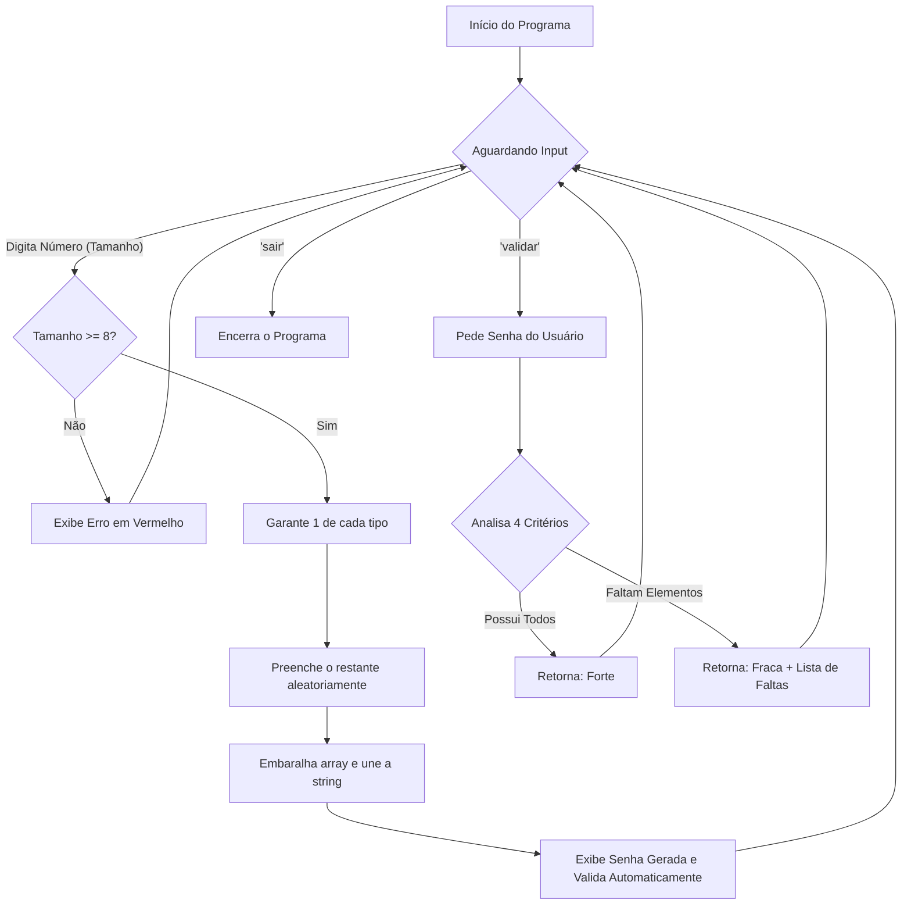

<h1
    align="center"
>
    🔐 Projeto 04: Gerador e Validador de Senhas
</h1>

## 🎯 Objetivo do projeto

<p align="justify">Desenvolver uma aplicação de linha de comando (CLI) em Python que funciona como um gerador de senhas altamente seguras e como um validador da força de senhas inseridas pelo utilizador. Este projeto foca-se em garantir a criação de credenciais robustas que resistam a ataques de força bruta, utilizando um sistema interativo com feedback visual e aplicando conceitos de aleatoriedade e análise combinatória na prática.</p>

## ✨ Funcionalidades


* **Geração Criptograficamente Forte:** Cria senhas aleatórias garantindo a presença de pelo menos uma letra maiúscula, uma minúscula, um número e um caractere especial utilizando as bibliotecas string e random.
* **Validador de Força:** Analisa senhas inseridas ou geradas pelo sistema, retornando um diagnóstico exato de quais elementos estão em falta para torná-la forte.
* **Interface Colorida (CLI):** Utiliza a biblioteca colorama para fornecer feedback visual instantâneo (verde para sucesso, vermelho para erros/senhas fracas, amarelo para inputs).
* **Tratamento de Exceções:** O programa aplica Programação Defensiva, impedindo quebras causadas por entradas de letras onde números são esperados (ValueError) e gerindo encerramentos forçados de forma segura (KeyboardInterrupt e EOFError).

## ✖️📐 Lógica Matemática Aplicada

<p
    align="justify"
>
    A segurança das senhas geradas por este programa baseia-se nos princípios da <b>Análise Combinatória</b> e da <b>Entropia da Informação</b>. As seguintes lógicas foram aplicadas:
</p>

* **Espaço de Combinações ($N$):** O número total de senhas possíveis depende do tamanho da base de caracteres disponíveis ($C$) e do comprimento da senha ($L$). A fórmula de combinações com repetição é:

$$N = C^L$$

<p
    align="justify"
>
    No nosso código, temos $C = 94$ (26 maiúsculas, 26 minúsculas, 10 dígitos, 32 símbolos). Para a senha mínima exigida ($L = 8$), o espaço amostral é $N = 94^8 \approx 6.09 \times 10^{15}$ (mais de 6 quatrilhões de possibilidades).
</p>

* **Entropia ($E$):** Mede a imprevisibilidade de uma senha em bits. Quanto maior a entropia, mais tempo um computador levaria para adivinhar a senha num ataque de força bruta:

$$E = L \cdot \log_2(C)$$

<p
    align="justify"
>
    Para uma senha gerada de 12 caracteres usando o nosso algoritmo, a entropia seria $E = 12 \cdot \log_2(94) \approx 78.65$ bits (senhas acima de 60 bits são consideradas muito fortes).
</p>

### Fluxograma de Execução



## 🛠️ Como executar

<p
    align="justify"
>
    
    1. Certifique-se de que tem o Python instalado na sua máquina.
    
    2. Instale a dependência visual executando no terminal: <code>pip install colorama</code>
    
    3. No terminal, navegue até à pasta onde o ficheiro se encontra e execute o comando abaixo:
    
</p>

```bash
    python password_manager.py
```

<p
    align="justify"
>
    4. Digite o tamanho numérico desejado para gerar uma nova senha ou escreva <code>validar</code> para testar a força de uma senha existente.
</p>

## ✨ O que aprendi e como isso se aplica à IA?

<p
    align="justify"
>
    A função de validação funciona de forma muito semelhante à etapa de <b>Extração de Características (Feature Extraction)</b> em Machine Learning. O algoritmo varre a string de entrada para extrair "features" booleanas (se tem maiúsculas, minúsculas, etc.). Em modelos de IA tradicionais, analisar a presença ou ausência de padrões específicos em dados é o primeiro passo para que o algoritmo consiga classificar algo (neste caso, classificar uma senha como Forte ou Fraca). Além disso, este projeto utiliza um sistema baseado em regras (<i>Rule-Based System</i>), que serve de fundação para entender como Inteligências Artificiais mais avançadas substituem lógicas estritas por heurísticas e redes neurais para identificar padrões complexos de segurança.
</p>