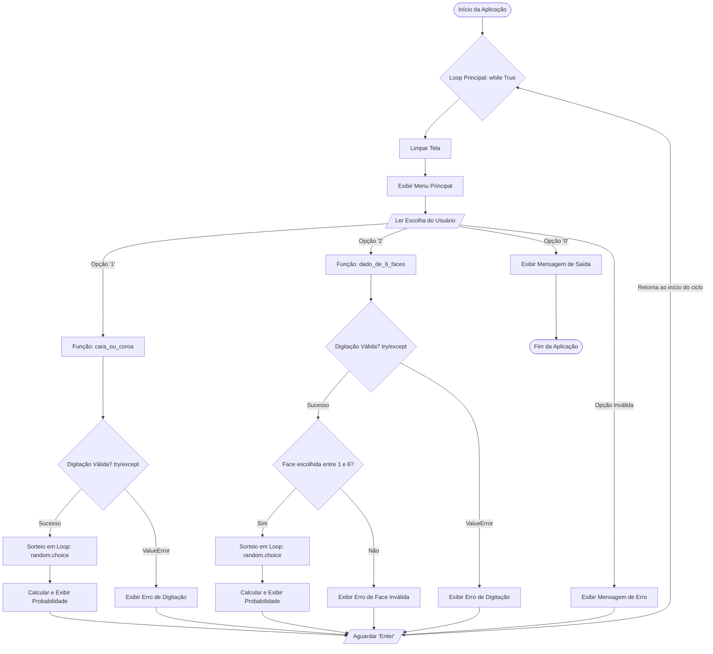

<h1
    align="center"
>
    Projeto 08: Comprovador da Lei dos Grandes Números 🎲🪙
</h1>

<p
    align="center"
>
    Este projeto é um simulador interativo desenvolvido em Python que comprova na prática a <strong>Lei dos Grandes Números</strong>. O programa permite que o usuário simule milhares (ou até milhões) de lançamentos de uma moeda ou de um dado de 6 faces, calculando a probabilidade empírica e demonstrando como a aleatoriedade converge para a probabilidade teórica conforme o volume de dados aumenta.
</p>

## 🎯 Objetivos do Projeto

Este projeto foi desenvolvido para consolidar habilidades práticas de programação e fortalecer a base matemática necessária para o estudo de Inteligência Artificial:

* **Comprovação Empírica da Matemática:** Demonstrar visualmente e na prática a "Lei dos Grandes Números", provando como a aleatoriedade (ruído) diminui e o resultado se alinha à probabilidade teórica quando usamos grandes volumes de dados.
* **Simulação Computacional:** Utilizar algoritmos e funções nativas do Python para recriar com precisão o comportamento de sistemas físicos imprevisíveis (lançamento de moedas e rolagem de dados).
* **Desenvolvimento de CLI Robusta:** Construir uma Interface de Linha de Comando (CLI) profissional, focada na experiência do usuário, utilizando loops de repetição infinitos e funções de limpeza automática de tela.
* **Tratamento de Exceções:** Implementar barreiras de segurança com blocos `try...except` para capturar e tratar erros de digitação, impedindo a quebra abrupta do programa.
* **Fundamentação para Machine Learning:** Compreender o impacto direto da variância e da quantidade de dados (Big Data) no treinamento e na confiabilidade de modelos estatísticos e IAs.

## 🔄 Fluxograma de Navegação

O programa foi construído com um menu em loop contínuo, tratamento de erros e limpeza de tela, seguindo esta estrutura lógica:



## 🧮 A Matemática por Trás (Fundamentos para IA)

Este projeto aplica conceitos fundamentais de estatística e probabilidade que formam a base do aprendizado de máquina (Machine Learning). O entendimento destas fórmulas ajuda a explicar como as IAs lidam com incertezas e porque os modelos precisam de grandes volumes de dados para serem confiáveis.

### 1. Probabilidade Empírica vs. Teórica

A **probabilidade teórica** é calculada de forma matemática e idealizada, antes de o evento acontecer, mapeando o espaço amostral. A **probabilidade empírica** (ou probabilidade experimental) é a taxa de sucesso baseada na observação do mundo real, contando o que de fato aconteceu após os testes.

A equação da probabilidade teórica para eventos onde todas as chances são iguais (equiprováveis) é:

$$P_{teorica}(E) = \frac{\text{Número de Resultados Favoráveis}}{\text{Número Total de Resultados Possíveis}}$$

Já a fórmula da probabilidade empírica, que é exatamente a matemática que aplicamos dentro das nossas funções de simulação (`probabilidade = sucessos / total`), é calculada por:

$$P_{empirica}(E) = \frac{\text{Número de Ocorrências Observadas do Evento}}{\text{Número Total de Tentativas (Lançamentos)}}$$

Aplicando aos nossos cenários:

* **Na Moeda:** 

$P_{teorica}(\text{Cara}) = \frac{1}{2} = 0.5$ (ou **50%**)

* **No Dado:** 

$P_{teorica}(\text{Face Escolhida}) = \frac{1}{6} \approx 0.1666$ (ou **16.66%**)


### 2. A Lei dos Grandes Números (LGN)

A Lei dos Grandes Números é um teorema central da teoria das probabilidades. Ela estabelece que a média dos resultados obtidos de um grande número de tentativas deve se aproximar do valor esperado, e essa aproximação se torna cada vez mais precisa à medida que mais tentativas são realizadas.

Na linguagem do cálculo, nós descrevemos a convergência dessa probabilidade usando a notação de limite para representar que, quando o número de tentativas ($N$) cresce em direção ao infinito, a variação empírica se iguala à verdade matemática:

$$\lim_{N \to \infty} P_{empirica}(E) = P_{teorica}(E)$$

### 3. Como isso se aplica à Inteligência Artificial?

* **O Problema do Ruído (Variância):** Em amostras pequenas (ex: lançar a moeda 10 vezes e obter 70% de caras), os resultados sofrem fortes distorções aleatórias. Se uma IA é treinada com poucos dados, ela aprende essas distorções como se fossem regras absolutas (um erro crítico de Machine Learning conhecido como *Overfitting*).
* **A Verdade no Big Data:** A LGN prova matematicamente o porquê de precisarmos de bases de dados massivas. O "ruído" estatístico só é diluído quando a variável $N$ é extremamente grande. Ao utilizar milhares ou milhões de exemplos de treinamento, garantimos que o modelo de IA consiga enxergar os padrões reais e generalizáveis do mundo em vez de focar em flutuações e anomalias isoladas.

## 💻 Tecnologias e Conceitos Utilizados

Este projeto foi construído utilizando apenas módulos nativos do Python, aplicando conceitos essenciais de lógica de programação para simular ambientes estatísticos:

* **Python 3:** Linguagem base utilizada para estruturar toda a lógica matemática e navegação do simulador.
* **Módulo `random` (`choice`):** Ferramenta fundamental para gerar a aleatoriedade. A função `choice()` foi escolhida por sua eficiência de processamento em selecionar um item aleatório diretamente de uma lista, simulando perfeitamente as chances reais de uma moeda ou dado.
* **Módulo `os` (`system`):** Utilizado para interagir diretamente com o sistema operacional e executar a limpeza do terminal (`cls` no Windows, `clear` no Linux/macOS), garantindo uma interface de usuário limpa e um menu sempre posicionado no topo.
* **Estruturas de Repetição (Loops):**
  * `while True`: Responsável por encapsular o programa em um loop infinito, permitindo que o usuário faça múltiplas simulações sem precisar reiniciar o script. O comando `break` atua como a única rota de saída (opção 0).
  * `for i in range()`: Responsável por executar o "motor" do simulador, rodando o bloco de código de sorteio milhares ou milhões de vezes em frações de segundo.
* **Tratamento de Exceções (`try...except`):** Implementação de barreiras de segurança para capturar o erro `ValueError`. Isso evita que a aplicação sofra um "crash" (fechamento forçado) caso o usuário digite texto ou símbolos nos inputs onde números inteiros são estritamente necessários.
* **Formatação de Dados (`f-strings`):** Uso do formatador interno `:.2%` dentro das mensagens de resposta, que instrui o Python a multiplicar o resultado decimal por 100, adicionar o símbolo de porcentagem e limitar o resultado a duas casas decimais automaticamente (ex: `0.1666...` vira `16.66%`).

## 🚀 Como Executar

Siga os passos abaixo para rodar o simulador na sua máquina:

1. **Pré-requisito:** Certifique-se de ter o [Python 3](https://www.python.org/downloads/) instalado no seu sistema.
2. **Download do Projeto:** Clone este repositório do GitHub ou baixe o arquivo `main.py` diretamente para uma pasta no seu computador.
3. **Acesse o Terminal:** Abra o seu terminal de preferência (Prompt de Comando, PowerShell ou terminal do Linux/Mac).
4. **Navegue até a Pasta:** Use o comando `cd` para entrar no diretório onde o arquivo `main.py` foi salvo. Exemplo:

```bash
    cd caminho/para/a/pasta/do/projeto
```

5. **Inicie o Simulador:** Execute o comando abaixo para iniciar o programa:

```bash
    python main.py
```

6. **Interaja com o Menu:** O terminal será limpo automaticamente e o menu principal aparecerá. Digite o número correspondente à simulação desejada, siga as instruções na tela informando a quantidade de lançamentos e veja a matemática agir! Para encerrar a aplicação com segurança, basta escolher a opção `0`.